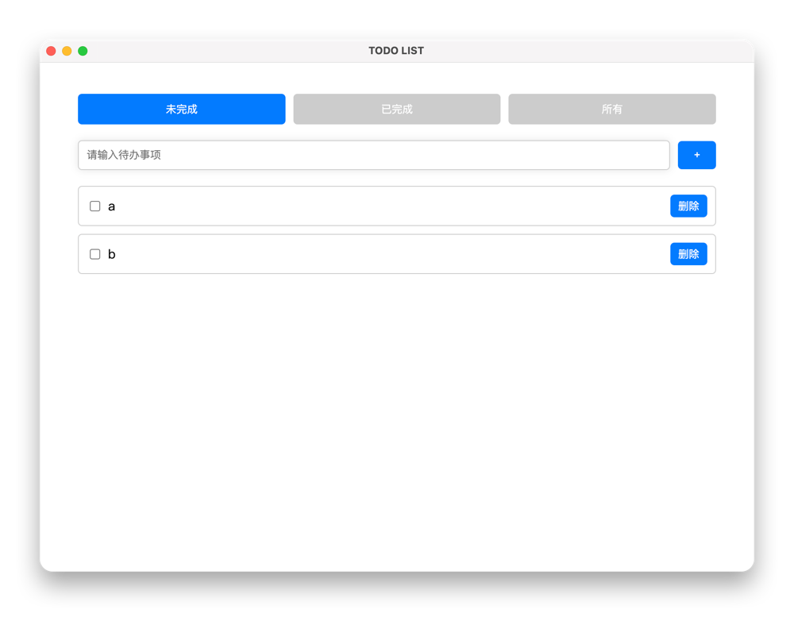

# todo list

一个用于记录todo的工具

## 在 MAC 打开快捷键
显示窗口 command+2
## Project Setup

### Install

```bash
$ yarn
```

### Development

```bash
$ yarn dev
```

### Build

```bash
# For windows
$ yarn build:win

# For macOS
$ yarn build:mac

# For Linux
$ yarn build:linux
```
